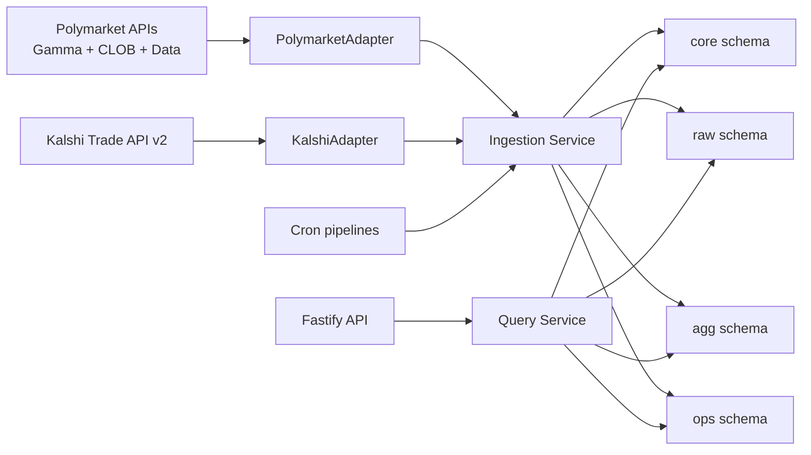
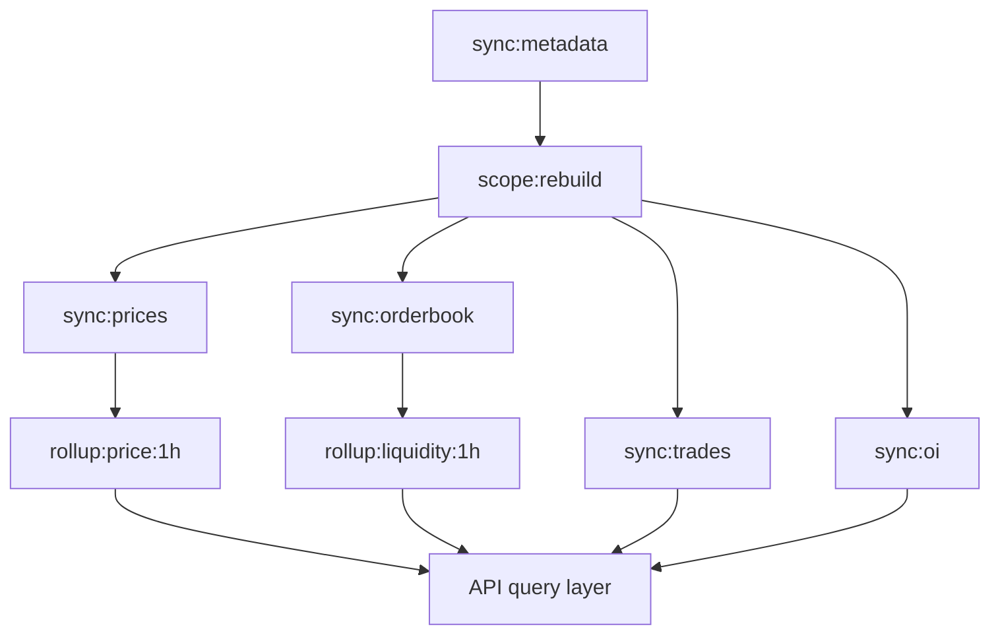
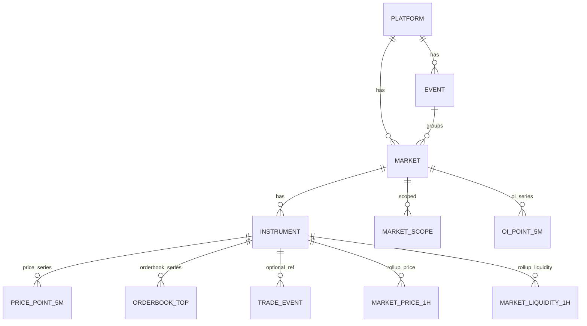

# Prediction Markets Project Context

## 1. Purpose and Audience
This document is the single contextual entrypoint for engineers and AI agents working in this repository.

Use this file for system-level understanding, implementation context, and operations. Use [README.md](/Users/vrtnd/prediction_markets/README.md) for quickstart commands only.

This file is intentionally deeper than the README and is written to be decision-supporting for implementation work.

## 2. System Overview
The system is a provider-agnostic prediction market ingestion service.

Core flow:
1. Provider adapters fetch and normalize external data.
2. Ingestion services upsert normalized data into Postgres (`core`, `raw`, `agg`, `ops`).
3. Cron commands execute explicit ingestion pipelines (`topN_live`, `full_catalog`, `full_catalog_resume`) with DB advisory lock overlap guards.
4. Query services read from canonical tables and expose API payloads through Fastify.

Architectural principle:
1. Shared canonical core model (`platform -> event -> market -> instrument`).
2. Provider-specific fetch/parsing logic isolated in adapter implementations.



## 3. Runtime and Tooling
1. Runtime: Node 22.
2. Package manager: npm.
3. API framework: Fastify.
4. DB access: Drizzle ORM + SQL.
5. Database: PostgreSQL.
6. Job orchestration: cron-driven CLI pipelines + advisory locks.
7. Logging: pino.
8. Timestamp policy: UTC in storage and API payloads.
9. Probability scale: canonical `0..1`.

## 4. Repository Map
Primary module map:
1. `src/app`: Fastify boot, health/meta/market routes.
2. `src/adapters`: Provider contract + `polymarket` and `kalshi` implementations.
3. `src/services`: Ingestion orchestration, scope, rollups, query/read layer, checkpoints.
4. `src/cron`: Top-level cron pipelines (`topN_live`, `full_catalog`).
5. `src/jobs`: Job-name constants and handler compatibility layer for direct execution.
6. `src/db`: Drizzle schema, migration runner, DB setup/seed.
7. `src/cli`: Manual ingestion and verification commands.
8. `knowledge`: Supporting documentation and API notes.

## 5. Canonical Domain Model
Canonical entities:
1. `platform`: data provider (`polymarket`, `kalshi`).
2. `event`: grouping unit for markets.
3. `market`: tradable contract/question.
4. `instrument`: tradable outcome side used for prices/orderbook.

Identifier rules:
1. Internal joins use numeric surrogate keys.
2. Public market identifier is `marketUid = provider:marketRef`.

Provider mapping:
1. Polymarket:
- `marketRef = conditionId`.
- `instrumentRef = token_id` from `clobTokenIds` (YES/NO tokens).
- Orderbook is per token instrument.
2. Kalshi:
- `marketRef = ticker`.
- Synthetic instruments per market: `${ticker}:YES`, `${ticker}:NO`.
- Orderbook API is bids-only per market; asks are implied by complement logic.

## 6. Database Schemas and Tables
Schemas:
1. `core`: normalized entities and scope.
2. `raw`: provider snapshots/points.
3. `agg`: rolled-up analytics tables.
4. `ops`: checkpoints and run logs.

### `core` (canonical entities)
1. `core.platform`
2. `core.event`
3. `core.market`
4. `core.instrument`
5. `core.market_scope`
6. `core.category_dim`
7. `core.market_category_assignment`
8. `core.provider_category_dim`
9. `core.provider_category_map`

Key constraints:
1. `market` unique `(platform_id, market_ref)`.
2. `instrument` unique `(market_id, instrument_ref)`.
3. `market_uid` unique globally.
4. `provider_category_dim` unique `(platform_id, source_kind, code)`.
5. `provider_category_map` unique `(platform_id, source_kind, source_code)`.

### `raw` (time series + events)
1. `raw.price_point`:
- key: `(instrument_id, ts)` unique
- fields: `price`, `source`
2. `raw.orderbook_top`:
- key: `(instrument_id, ts)` unique
- fields: `best_bid`, `best_ask`, `spread`, depth metrics
3. `raw.trade_event`:
- key: `(provider_code, trade_ref)` unique
- fields: `market_id`, `instrument_id nullable`, `ts`, `side`, `price`, `qty`, `notional_usd`, `trader_ref`, `source`, `raw_json`
4. `raw.oi_point_5m`:
- key: `(provider_code, market_id, ts)` unique
- fields: `value`, `unit`, `source`, `raw_json`

### `agg` (rollups)
1. `agg.market_price_1h`:
- key: `(instrument_id, bucket_ts)` unique
- fields: `open`, `high`, `low`, `close`, `points`
2. `agg.market_liquidity_1h`:
- key: `(instrument_id, bucket_ts)` unique
- fields: `avg_spread`, `avg_bid_depth_top5`, `avg_ask_depth_top5`, `bbo_presence_rate`, `sample_count`
3. `agg.provider_category_1h`:
- key: `(provider_code, group_by, category_code, bucket_ts)` unique
- fields: provider/category treemap aggregates for `volume24h` and `oi` (`total` + `active`) plus market counts; supports `group_by=sector|provider_category`

### `ops` (operations)
1. `ops.ingest_checkpoint`:
- key: `(provider_code, job_name)` unique
- `cursor_json` stores job-specific progress/cursor state
2. `ops.job_run_log`:
- statuses: `running`, `success`, `partial_success`, `failed`
- fields: rows upserted/skipped, error text, timestamps

Operational note:
1. `ops.job_run_log` and `ops.ingest_checkpoint` remain the canonical operational observability/state tables.

## 7. Provider Adapters
Adapter contract (from `src/adapters/types.ts`):
1. `listEvents`
2. `listMarkets`
3. `listInstruments`
4. `listPricePoints`
5. `listOrderbookTop`
6. `listTrades`
7. `listOpenInterest`
8. `normalizeMarketRef`
9. `normalizeInstrumentRef`

### Polymarket adapter
Sources:
1. Gamma API: metadata discovery (`/events`, `/markets`) via offset pagination.
2. CLOB API: prices and orderbook (`/prices-history`, `/book`).
3. Data API: trades and open interest (`/trades`, `/oi`).

Fetch mechanics:
1. Metadata uses offset pagination with run budgets (`POLYMARKET_METADATA_RUN_BUDGET_MS`, `POLYMARKET_METADATA_MAX_REQUESTS_PER_RUN`).
2. Full-catalog/backfill discovery is checkpointed and resumable across runs (`ops.ingest_checkpoint` cursors).
3. Trades fetch uses `filterType=CASH` + `filterAmount` threshold with request/time budgets (`POLYMARKET_TRADES_MAX_REQUESTS_PER_RUN`, `POLYMARKET_TRADES_RUN_BUDGET_MS`).

Normalization:
1. Market refs are lowercased condition IDs.
2. Price/orderbook values normalized to `0..1` where applicable.
3. Large-bet threshold configured by `POLYMARKET_LARGE_BET_USD_THRESHOLD`.

### Kalshi adapter
Source:
1. Trade API v2 (`KALSHI_BASE_URL`, default `https://api.elections.kalshi.com/trade-api/v2`).

Fetch mechanics:
1. Discovery uses cursor paging (`next_cursor`/`cursor`) with `mve_filter=exclude`.
2. Candlesticks use batch endpoint and 10k-candle response cap aware chunking.
3. Trades use `/markets/trades` cursor pagination with request/time budgets (`KALSHI_TRADES_MAX_REQUESTS_PER_RUN`, `KALSHI_TRADES_RUN_BUDGET_MS`).
4. OI points use `/markets/{ticker}` snapshot fields (`open_interest` / `open_interest_fp`).

Normalization:
1. Synthetic instrument refs: `${ticker}:YES` and `${ticker}:NO`.
2. Orderbook asks are derived via complement from bids.
3. Kalshi trade `instrumentRef` maps from `taker_side` when available.

Known behavior notes:
1. Some Kalshi markets can return sparse candles depending on market activity/history tier.
2. Kalshi historical data may require historical endpoints for long-term backfills.
3. Polymarket `prices-history` can be sparse on resolved markets in some intervals (see `knowledge/api.md`).

## 8. Ingestion Pipelines and Jobs
High-level pipeline:
1. Metadata sync -> upsert `core` entities.
2. Scope rebuild -> populate `core.market_scope`.
3. Snapshot/time-series ingestion -> `raw`.
4. Rollups -> `agg`.
5. Query layer exposes API payloads.



Implemented job names:
1. Shared:
- `cron:topn-live`
- `cron:full-catalog`
- `cron:full-catalog:resume`
- `scope:rebuild`
- `analytics:category:assign:markets`
- `analytics:rollup:price:1h`
- `analytics:rollup:liquidity:1h`
- `analytics:rollup:provider-category:1h`
2. Polymarket:
- `polymarket:sync:metadata`
- `polymarket:sync:metadata:backfill_full`
- `polymarket:sync:prices`
- `polymarket:sync:prices:full_catalog`
- `polymarket:sync:orderbook`
- `polymarket:sync:orderbook:full_catalog`
- `polymarket:sync:trades`
- `polymarket:sync:trades:full_catalog`
- `polymarket:sync:oi`
- `polymarket:sync:oi:full_catalog`
3. Kalshi:
- `kalshi:sync:metadata`
- `kalshi:sync:prices`
- `kalshi:sync:prices:full_catalog`
- `kalshi:sync:orderbook`
- `kalshi:sync:orderbook:full_catalog`
- `kalshi:sync:trades`
- `kalshi:sync:trades:full_catalog`
- `kalshi:sync:oi`
- `kalshi:sync:oi:full_catalog`

Job write targets:
1. `polymarket:sync:metadata` -> `core.event`, `core.market`, `core.instrument`, checkpoint update in `ops.ingest_checkpoint`.
2. `polymarket:sync:metadata:backfill_full` -> same as metadata, with resumable cursor state in `ops.ingest_checkpoint`.
3. `kalshi:sync:metadata` -> `core.event`, `core.market`, `core.instrument`, checkpoint update in `ops.ingest_checkpoint`.
4. `scope:rebuild` -> rewrites provider rows in `core.market_scope`.
5. `analytics:category:assign:markets` -> upsert into `core.category_dim`, `core.provider_category_dim`, `core.provider_category_map`, and `core.market_category_assignment`.
6. `polymarket:sync:prices` and `kalshi:sync:prices` -> upsert into `raw.price_point`.
7. `polymarket:sync:orderbook` and `kalshi:sync:orderbook` -> upsert into `raw.orderbook_top`.
8. `polymarket:sync:trades` and `kalshi:sync:trades` -> upsert into `raw.trade_event`.
9. `polymarket:sync:oi` and `kalshi:sync:oi` -> upsert into `raw.oi_point_5m`.
10. `analytics:rollup:price:1h` -> upsert into `agg.market_price_1h`.
11. `analytics:rollup:liquidity:1h` -> upsert into `agg.market_liquidity_1h`.
12. `analytics:rollup:provider-category:1h` -> upsert into `agg.provider_category_1h`.

## 9. Scheduling, Cadence, and Checkpoints
Cadence:
1. `cron:topn-live` (recommended every 5 minutes):
- mode: `topN_live`
- scope source: `core.market_scope`
- steps per provider: prices, orderbook, trades, oi (`scopeStatus=active`)
2. `cron:full-catalog` (recommended every 4 hours):
- mode: `full_catalog`
- scope source: active markets from `core.market`/`core.instrument` with cursorized batch selection
- steps per provider: metadata, market-event relink, scope rebuild, full-catalog prices/orderbook/trades/oi, category assignment, provider-category rollup, hourly price/liquidity rollups
3. `cron:full-catalog:resume` (recommended every 15 minutes where scheduler timeout is strict):
- mode: `full_catalog`
- orchestration state: provider/step pointer persisted in `ops.ingest_checkpoint` under system key
- each invocation executes bounded work and resumes from latest provider/step on next invocation
4. Overlap policy:
- each cron command acquires a DB advisory lock
- if lock is held, run is skipped and logged (`skipped_lock_held`)

Checkpoint strategy:
1. Checkpoints stored in `ops.ingest_checkpoint` keyed by provider + job.
2. Logical checkpoint key format: `${provider_code}:${job_name}` (stored as columns `provider_code`, `job_name` with a uniqueness constraint).
3. Cursor format is job-specific JSON.
4. `full_catalog` selectors persist market cursor state (`nextMarketCursorId`, cycle metadata) per sync step.
5. Incremental windows (prices/trades/oi) are mode-aware and scope-aware (`topN_live` vs `full_catalog`).
6. Successful and partial-success runs advance/checkpoint state; failures log but do not corrupt prior cursor state.

## 10. API Surface (Current)
Implemented endpoints:
1. `GET /healthz`: process liveness.
2. `GET /readyz`: DB readiness check.
3. `GET /v1/meta/providers`: platform list.
4. `GET /v1/meta/coverage`: entity/snapshot coverage summary.
5. `GET /v1/meta/ingest-health`: last-run status/error profile per job.
6. `GET /v1/meta/data-freshness`: lag and latest timestamp snapshot for raw + agg feeds.
7. `GET /v1/meta/category-quality`: scoped/global unknown-rate and source-mix category quality metrics.
8. `GET /v1/markets`: market list (optional provider filter + pagination).
9. `GET /v1/markets/:marketUid`: market + instrument snapshot detail.
10. `GET /v1/events/:eventUid`: event detail + child markets with nested instrument snapshots.
11. `GET /v1/dashboard/main`: provider KPIs + event-level payload (optional `provider=polymarket|kalshi`) with nested scoped markets/instruments.
12. `GET /v1/dashboard/treemap`: provider/category treemap aggregates (`metric=volume24h|oi`, `status=all|active`, `groupBy=sector|providerCategory`, optional provider filter).

Contract notes:
1. `marketUid` is always `provider:marketRef`.
2. `eventUid` is always `provider:eventRef`.
3. `/v1/markets/:marketUid` is market-only (event refs return 404); event-level aggregate pages use `/v1/events/:eventUid`.
4. Timestamps returned as ISO strings in UTC-compatible format.
5. `/v1/dashboard/main` is event-centric and sourced from `core.market_scope` rather than global market listings.

## 11. Data Quality, Verification, and Freshness
Verification commands:
1. `npm run verify:summary`
2. `npm run verify:summary:strict`

`verify:summary` provides:
1. Latest run status per job.
2. Table row counts.
3. Scope counts and status distribution.
4. Fill-rate checks and sample freshness rows.

Strict mode checks currently enforce:
1. Minimum scoped market count.
2. Minimum price fill-rate.
3. Minimum orderbook BBO fill-rate.
4. No latest failed jobs.

Freshness interpretation:
1. Use `/v1/meta/data-freshness` for per-provider lag across raw price/orderbook/trades/OI and hourly rollups.
2. Rollup lag should typically track the top of the current/previous hour bucket.

To validate current state now, run commands in Appendix A rather than relying on static numbers in docs.

## 12. Operational Runbook
### Bootstrap
1. `npm install`
2. `cp .env.example .env`
3. `npm run db:prepare`

### Single-provider ingest (manual)
Polymarket:
1. `npm run ingest:metadata`
2. `npm run ingest:prices`
3. `npm run ingest:orderbook`
4. `npm run ingest:trades`
5. `npm run ingest:oi`

Kalshi:
1. `npm run ingest:kalshi:metadata`
2. `npm run ingest:kalshi:prices`
3. `npm run ingest:kalshi:orderbook`
4. `npm run ingest:kalshi:trades`
5. `npm run ingest:kalshi:oi`

### Dual-provider ingest
1. `npm run ingest:all`

### Cron pipelines
1. `npm run cron:topn-live`
2. `npm run cron:full-catalog`

### Rollups
1. `npm run ingest:categories`
2. `npm run ingest:categories:backfill`
3. `npm run ingest:rollups`

### Verification
1. `npm run verify:summary`
2. `npm run verify:summary:strict`
3. Optional API checks:
- `/v1/meta/ingest-health`
- `/v1/meta/data-freshness`

### Common failure modes and quick triage
1. API rate limits / transient 5xx:
- retried by `fetchJsonWithRetry`; check job logs for warning bursts.
2. Empty or sparse series:
- verify market activity scope and provider endpoint behavior before treating as bug.
3. Metadata truncation:
- check run-budget/request-budget settings and checkpoint cursors.
4. Endpoint shape drift:
- inspect `raw_json` payloads and adapter parsing assumptions.
5. Cron overlap skips:
- verify advisory lock keys and long-running previous executions (`skipped_lock_held` in logs).

## 13. Known Limitations and Deferred Work
Deferred by design:
1. Arbitrage opportunity engine.
2. Similar-poll matching and cross-platform candidate tables.
3. Comments ingestion (currently not in pipeline).
4. Full UI-layer contracts for market overview/single poll active feed beyond current APIs.

Current implementation caveats:
1. `topN_live` and `full_catalog` serve different latency/coverage goals; monitor both freshness and full-universe coverage.
2. Provider-specific endpoint quirks are tracked in `knowledge/api.md`.
3. Matching strategy target remains deterministic candidate generation with optional AI rerank in a future iteration.

## 14. Change Log and Maintenance Notes
This file is maintained on a best-effort basis.

Recommendation:
1. Update this file whenever schema, adapter contract, job names/topology, or public API changes.
2. Keep implementation references synchronized with actual paths and command names.

| Date (UTC) | Change | Files Touched |
|---|---|---|
| 2026-03-02 | Replaced pg-boss orchestration with cron pipelines (`topN_live`, `full_catalog`), added advisory lock skip policy, and introduced full-catalog ingestion mode. | `src/cli/main.ts`, `src/cron/pipelines.ts`, `src/services/cron-lock-service.ts`, `src/services/ingestion-service.ts`, `src/config/env.ts`, `README.md`, `knowledge/PROJECT_CONTEXT.md` |
| 2026-03-01 | Initial canonical context file created. | `knowledge/PROJECT_CONTEXT.md` |
| 2026-03-01 | Added category assignment and provider-category treemap rollup context. | `src/services/category-service.ts`, `src/jobs/*`, `src/app/server.ts`, `src/services/query-service.ts`, `src/db/schema.ts`, `src/migrations/0003_black_havok.sql`, `knowledge/PROJECT_CONTEXT.md` |
| 2026-03-01 | Added Phase B two-layer taxonomy (canonical sectors + provider categories), scoped/all classification modes, category quality endpoint, treemap `groupBy`, and backfill checkpoints. | `src/services/category-taxonomy.ts`, `src/services/category-service.ts`, `src/services/query-service.ts`, `src/app/server.ts`, `src/cli/main.ts`, `src/db/schema.ts`, `src/migrations/0004_vengeful_jimmy_woo.sql`, `knowledge/PROJECT_CONTEXT.md` |

## Appendix A: Command Reference
```bash
# Setup
npm install
cp .env.example .env
npm run db:prepare

# Run service
npm run start
npm run cron:topn-live
npm run cron:full-catalog

# Polymarket ingest
npm run ingest:metadata
npm run ingest:metadata:backfill
npm run ingest:prices
npm run ingest:orderbook
npm run ingest:trades
npm run ingest:oi

# Kalshi ingest
npm run ingest:kalshi:metadata
npm run ingest:kalshi:prices
npm run ingest:kalshi:orderbook
npm run ingest:kalshi:trades
npm run ingest:kalshi:oi

# Rollups and combined
npm run ingest:categories
npm run ingest:categories:backfill
npm run ingest:rollups
npm run ingest:all

# Verification and checks
npm run verify:summary
npm run verify:summary:strict
curl -s http://localhost:3000/v1/meta/ingest-health
curl -s http://localhost:3000/v1/meta/data-freshness
curl -s http://localhost:3000/v1/meta/category-quality
```

## Appendix B: Glossary
1. `marketRef`: provider-native market key (`conditionId` for Polymarket, `ticker` for Kalshi).
2. `instrumentRef`: provider or synthetic outcome instrument key (`token_id` or `${ticker}:YES/NO`).
3. `marketUid`: composite public id `provider:marketRef`.
4. `BBO`: best bid / best ask.
5. `OI`: open interest.
6. `CLOB`: central limit order book.
7. `Scope`: top-N market set currently prioritized for high-frequency polling.
8. `Checkpoint`: persisted cursor/progress state per provider+job.


